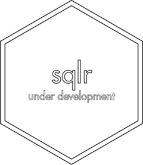

<!-- README.md is generated from README.Rmd. Please edit that file -->

# sqlr <a href='https://gipso.github.io/sqlr'></a>

<!-- badges: start -->

 [](https://www.repostatus.org/#wip)
[](https://lifecycle.r-lib.org/articles/stages.html#experimental)
[](https://github.com/gipso/sqlr/actions)
[](https://codecov.io/gh/gipso/sqlr?branch=main)
[](https://choosealicense.com/licenses/mit/)
[](https://gipso.github.io/mctq/CODE_OF_CONDUCT.html)
<!-- badges: end -->

## Overview

`sqlr` is an R package that provides a complete and consistent toolkit
to process Systematic Quantitative Literature Reviews (SQLR), a method
of systematic reviews presented by Catherine Pickering and Jason Byrne
in [2014](https://doi.org/10.1080/07294360.2013.841651). The aim of
`sqlr` is to facilitate the work of PhD candidates and other
early-career researchers with evidence synthesis while also helping with
research reproducibility.

Learn more about Systematic Quantitative Literature Reviews (SQLR)
[here](https://www.griffith.edu.au/griffith-sciences/school-environment-science/research/systematic-quantitative-literature-review).

## Prerequisites

You only need to have some familiarity with the [R programming
language](https://www.r-project.org/) to use `sqlr` main functions.

In case you don’t feel comfortable with R, we strongly recommend
checking Hadley Wickham and Garrett Grolemund’s free and online book [R
for data Science](https://r4ds.had.co.nz/) and the Coursera course from
John Hopkins University [Data Science: Foundations using
R](https://www.coursera.org/specializations/data-science-foundations-r)
(free for audit students).

## Installation

`sqlr` is still at the
[experimental](https://lifecycle.r-lib.org/articles/stages.html#experimental)
stage of development. That means people can use the package and provide
feedback, but it comes with no promises for long term stability.

You can install `sqlr` from GitHub with:

``` r
# install.packages("remotes")
remotes::install_github("gipso/sqlr")
```

## Citation

If you use `sqlr` in your research, please consider citing it. We put a
lot of work to build and maintain a free and open-source R package. You
can find the `sqlr` citation below.

``` r
citation("sqlr")
#> 
#> To cite {sqlr} in publications use:
#> 
#>   Vartanian, D., Pedrazzoli, M. (2021). {sqlr}: An R package for
#>   systematic quantitative literature reviews.
#>   https://gipso.github.io/sqlr/.
#> 
#> A BibTeX entry for LaTeX users is
#> 
#>   @Unpublished{,
#>     title = {{sqlr}: An R package for systematic quantitativeliterature reviews},
#>     author = {Daniel Vartanian and Mario Pedrazzoli},
#>     year = {2021},
#>     url = {https://gipso.github.io/sqlr/},
#>     note = {Lifecycle: experimental},
#>   }
```

## Contributing

`sqlr` is a community project, everyone is welcome to contribute. Take a
moment to review our [Guidelines for
Contributing](https://gipso.github.io/sqlr/CONTRIBUTING.html).

Please note that `sqlr` is released with a [Contributor Code of
Conduct](https://gipso.github.io/sqlr/CODE_OF_CONDUCT.html). By
contributing to this project, you agree to abide by its terms.
